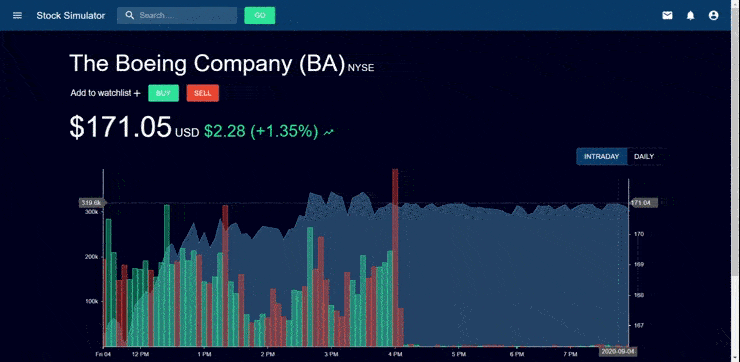

# stock-simulator



Stock data pulled from [Alpha Vantage](https://www.alphavantage.co/documentation/)
Charts created with [React-StockCharts](http://rrag.github.io/react-stockcharts/documentation.html) and [d3.js](https://github.com/d3/d3/wiki)

## Environment setup

You need to have [Go](https://golang.org/),
[Node.js](https://nodejs.org/),
[Docker](https://www.docker.com/), and
[Docker Compose](https://docs.docker.com/compose/)


## Database

```
docker-compose -f docker-compose-dev.yml up
```

This starts a local MongoDB on `localhost:27017`.

## Backend
Navigate to the `go-login` folder and start the back end:

```
cd go-login
go run main.go
```
The back end will serve on http://localhost:8080.

## Frontend
Navigate to the `static` folder, install dependencies,
and start the front end development server by running:
```
cd static
npm install
npm start
```
The application will be available on http://localhost:3000.
